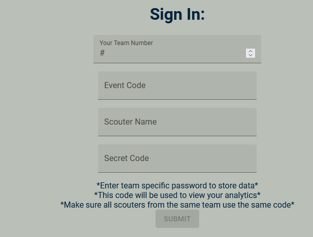
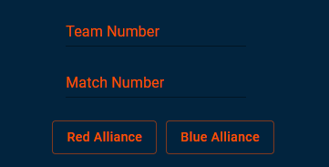
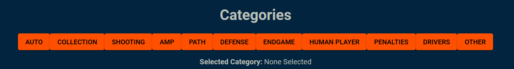

# QualScout: A Scouting Tool for FRC
### Developed by Team 2338: Gear It Forward

## What is QualScout? 
QualScout is a spinoff of our other scouting app, [GearScout](https://github.com/Team2338/GearScout2024), and is designed to be used in tandem with it. Unlike GearScout, however,  QualScout collects qualitative data, all stored in the same server as GearScout, allowing for seamless access to both types of information. 

## What do I need to use it?
All you need is a device that can connect to the internet! You do **NOT** need a steady internet connection, but you do need it to submit information.

## How do I access QualScout?
You can access QualScout [here](https://qual.gearitforward.com/). 

## How do I use QualScout?

### Signing in 
The Landing page, where you sign in, is the same as GearScout. There will be multiple fields for signing in. Enter your team number, event code, your name, and your secret code in the text fields.  Event and secret codes should be predetermined, and every scouter from the same team should use these codes.

### Entering Robot and Match Info
This is also entered the same way as in GearScout. At the top of the screen, you will see several text fields. Enter the robot and match numbers, as well as the alliance the team is on.

### Entering Data
In QualScout, there are several *categories* pertaining to a robot's performance in a match that scouters can take note of. Scouters would select the category they would like to write notes in using the buttons under the "Categories" section. The category will then show below the buttons.

Once a category is selected, scouters can write information pertaining to the topic in the text box below. Once the notes are completed, they can click "Submit Note" to prepare it for submission.

The notes will appear at the bottom of the page, in the "Submitted Notes" Category.

### Editing Notes
A new feature starting from v2024.2, QualScout now allows scouters to edit their notes after submission. Instead of encouraging scouters to submit another note in the same category, displaying this new note alongside the old one, they can now *edit* their note, eliminating the need for submitting multiple of them.

To edit notes, simply click the category you would like to change. Your previous notes will appear in the text box, where you can make any changes and follow the "Entering Data" section. The Submitted Notes section will display your updated notes after you click "Submit Note". 

Note: If you have any text in the text box, it will be OVERWRITTEN when you change categories, so be sure to save it (either in a category or your devices' clipboard).

Once you are finished, the "Submit" button will send all data to the server and clear the data on the frontend so you can start again.
