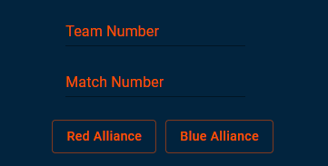

# QualScout: A Scouting Tool for FRC
### Developed by Team 2338: Gear It Forward

## What is QualScout? 
QualScout is a spinoff of our other scouting app, [GearScout](https://github.com/Team2338/GearScout2024), and is designed to be used in tandem with it. Unlike GearScout, however,  QualScout collects qualitative data, all stored in the same server as GearScout, allowing for seamless access to both types of information. 

## What do I need to use it?
All you need is a device that can connect to the internet! You do **NOT** need a steady internet connection, but you do need it to submit information.

## How do I access QualScout?
You can access QualScout [here](https://qual.gearitforward.com/). 

## How do I use QualScout?

### Signing in 
The Landing page, where you sign in, is the same as GearScout. There will be multiple fields for signing in. Enter your team number, event code, your name, and your secret code in the text fields.  Event and secret codes should be predetermined, and every scouter from the same team should use these codes.

### Entering Robot and Match Info
This is also entered the same way as in GearScout. At the top of the screen, you will see several text fields. Enter the robot and match numbers, as well as the alliance the team is on.

### Entering Data
In QualScout, there are several *categories* pertaining to a robot's performance in a match that scouters can take note of. Scouters would select the category they would like to write notes in